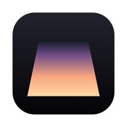
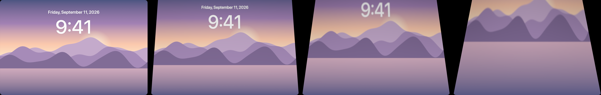

<p align="center"></p>

# Lidfold

**The iPhone Duo fold effect, on your MacBook lid.** Close the lid and the desktop stays anchored in space while the glass sweeps over it: the picture stretches toward the far edge, softens, and dissolves into shadow, following the hinge angle in real time.



I kept seeing the iPhone Duo's fold animation everywhere, and a few paid Mac apps that copy it. I wanted one that was free, open, and did nothing else. Lidfold is a menu bar app with no settings to tune. It reads the lid angle from the sensor Apple already ships in the hinge, captures the built-in display, and redraws it on the GPU as the lid moves. Nothing is recorded or saved.

Not affiliated with Apple. iPhone and MacBook are trademarks of Apple Inc.

## Requirements

- A MacBook with a lid angle sensor: MacBook Pro from 2019 on, or MacBook Air M2 or later. Desktops have no lid and no sensor.
- macOS 14 Sonoma or later.
- Screen Recording permission, granted once. The picture goes from ScreenCaptureKit to Metal and never leaves the GPU.

## Install

1. Download `Lidfold-<version>.zip` from [Releases](../../releases), unzip it, and drag **Lidfold.app** into **Applications**.
2. The app is signed but not notarized, so the first open needs one extra step. Either right-click **Lidfold.app** and choose **Open**, or run:

   ```sh
   xattr -dr com.apple.quarantine /Applications/Lidfold.app
   ```

3. Open it. A laptop icon appears in the menu bar and macOS asks for Screen Recording. Click **Open System Settings**, turn on **Lidfold** under **Privacy & Security → Screen & System Audio Recording**, and choose **Quit & Reopen** when offered.
4. Click the menu bar icon. The first line should read **Waiting for the lid** and the icon should show your current lid angle. If it still says **Needs Screen Recording**, quit Lidfold from the same menu and open it again.

Now close the lid slowly. The desktop starts to tilt as the lid passes 100° and is fully dark by about 8°. The menu has three items: **Follow the Lid** to turn the effect off and on, **Launch at Login**, and **Quit**.

## Good to know

- **With a monitor attached** the Mac stays awake when the lid shuts. The effect plays until the built-in display switches off, then ends, so nothing lands on the monitor.
- **Opening the lid** plays the effect in reverse if you reopen before the Mac sleeps. Once it has slept, waking ends the effect so you never come back to a tilted desktop.
- **A lid left half-closed** ends the effect after 20 seconds, so you can work at any angle.
- **A nudge while typing won't trigger it.** The lid has to be closing at a deliberate pace when it crosses 100°.
- **Nothing to tune.** The handful of numbers that define the look are in `Effect` at the top of `Sources/Lidfold/Preferences.swift` if you build from source. Set `anchored` to `false` there for the other common reading of the effect, where the whole desktop recedes away from you instead.

## Build from source

Needs only the Xcode Command Line Tools (`xcode-select --install`). Full Xcode is not required; the Metal shader compiles at runtime.

```sh
git clone https://github.com/colehollander10-netizen/lidfold.git
cd lidfold
./build.sh --install --run
```

`./build.sh --zip` writes a release zip; `--universal` adds an Intel slice. Each build is ad-hoc signed, so macOS treats it as a new app and asks for Screen Recording again. `--install` clears the stale grant for you.

## How it works

| File | Role |
|---|---|
| `LidAngleSensor.swift` | Reads the hinge angle over IOKit HID (usage page 0x20, usage 0x8A, feature report 7 or 1). No permission needed. |
| `LidMonitor.swift` | Polls at 50 Hz, smooths with a critically damped spring, and runs the state machine: idle, armed (capture warming up while the lid closes), active (overlay showing). |
| `ScreenStreamer.swift` | Streams the built-in display through ScreenCaptureKit into IOSurface-backed Metal textures. |
| `FoldShader.swift`, `FoldRenderer.swift` | One Metal pass. The desktop is held fixed in space while the glass rotates about the hinge toward you; a homography maps each glass pixel to the point your eye's ray hits on that fixed desktop, then a mip-chain disc blur and a shadow gradient follow the distance from the hinge. |
| `OverlayWindow.swift` | Click-through window over the built-in display, excluded from every screen capture so it never feeds back into its own picture. |

Events are appended to `~/Library/Logs/Lidfold.log`.

## Debug flags

```sh
swift build
.build/debug/Lidfold --probe 5               # print the lid angle for 5 seconds
.build/debug/Lidfold --render-demo /tmp/out   # render the effect at several angles to PNG
.build/debug/Lidfold --preview 45             # show the effect at a 45° lid on the main display
.build/debug/Lidfold --simulate-close         # scripted 120° → 0° → 120° lid, no sensor needed
.build/debug/Lidfold ... --capturable         # let screenshots see the overlay
```

## License

MIT. See [LICENSE](LICENSE).
